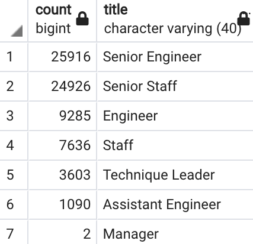
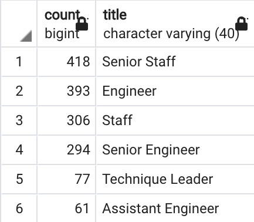
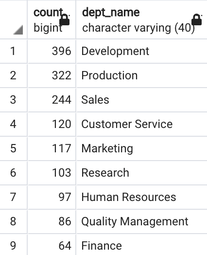
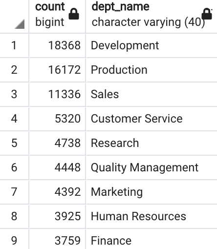

# Pewlett Hackard Analysis

## Overview of Project

### **Purpose**

The purpose of this analysis was to use SQL to analyze Pewlett Hackard employee data, determine the number of retiring employees per title, and identify employees who are eligible to participate in a mentorship program.

## Results

### **Analysis of Retiring Employees per Title**

- A total of 72,458 employees will be retiring. The image below details the breakdown of retiring employees by title:

    

- 

- A total of 1,549 employees are eligible to participate in a mentorship program. The image below provides the breakdown by title:

    

-

## Summary

- How many roles will need to be filled as the "silver tsunami" begins to make an impact?

    - 

- Are there enough qualified, retirement-ready employees in the departments to mentor the next generation of Pewlett Hackard employees?

- There are about 50 times

     