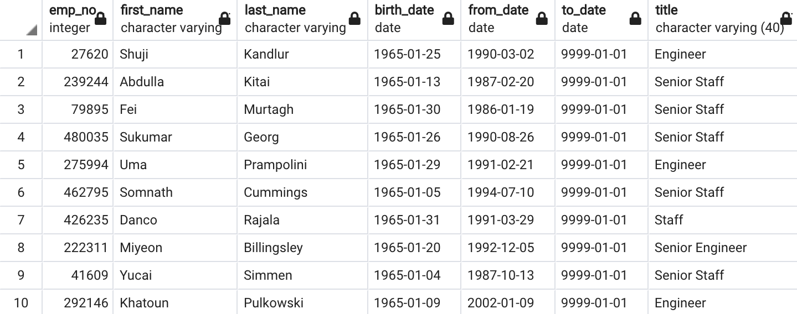

# Pewlett Hackard Analysis

## Overview of Project

### **Purpose**

The purpose of this analysis was to use SQL to:
1. determine the number of retiring Pewlett Hackard employees per title and
2. identify Pewlett Hackard employees who are eligible to participate in a mentorship program.

## Results

### **Analysis of Retiring Employees per Title**

- A total of 72,458 employees will be retiring. The image below details the breakdown of retiring employees by title:

- 

- A total of 1,549 employees are eligible to participate in a mentorship program. The image below provides the breakdown by title:

-

## Summary