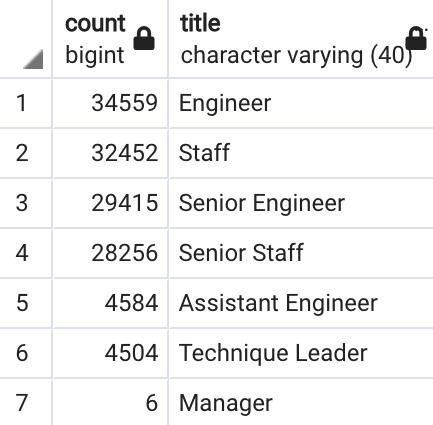

# Pewlett Hackard Analysis

## Overview of Project

### **Purpose**

The purpose of this analysis was to use SQL to analyze Pewlett Hackard employee data, determine the number of retiring employees per title, and identify employees who are eligible to participate in a mentorship program.

## Results

### **Analysis of Retiring Employees per Title**

- A total of 72,458 employees will be retiring. The image below details the breakdown of retiring employees by title:

    

- A look at the total titles (left table) from unique titles (right table) indicates that multiple employees have had title changes during their tenure at Pewlett Hackard.

    
    
    

- A total of 1,549 employees are eligible to participate in a mentorship program. The image below provides the breakdown by title:

    

-

## Summary

- A total of 72,458 employees will be retiring. Pewlett Hackard should begin filling positions as soon as retirement dates are announced.

- There are about 45 times more retiring staff in each department (left table) than there are staff who are membership eligible (right table), which is more than enough for each department to mentor the next generation of Pewlett Hackard employees. 

    
    
    